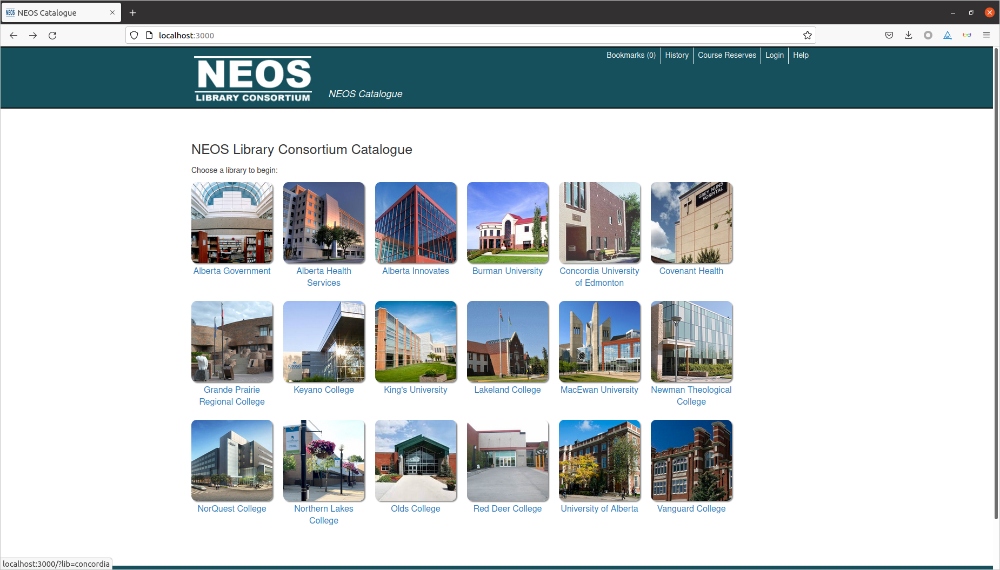

# Discovery interface for NEOS Libraries

This is the code base for the NEOS Libraries discovery platform. Based on [Project Blacklight](projectblacklight.org).

*   Depends on [Ruby](https://www.ruby-lang.org/en/) 2.6.x
*   Depends on [Bundler](https://bundler.io/) 1.17.3
*   Depends on an instance of [Solr](https://lucene.apache.org/solr/) with [this configuration](https://github.com/ualbertalib/blacklight_solr_conf)
*   Depends on a SQL database (sqlite in development and MySQL in staging/production)

## To get the application up and running for development:

Setup up [Discovery application](https://github.com/ualbertalib/discovery#to-get-the-application-up-and-running-for-development).  
This will get you production like data in Solr.  Ensure that Solr is running 
but the rails server is not.

1.  clone this repository (`git clone https://github.com/ualbertalib/NEOSDiscovery`)
2.  run `bundle install`
3.  `bundle exec rails db:create && bundle exec rails db:migrate`
4.  `bundle exec rails s`
5.  Point your browser to [http://localhost:3000/]()

# Testing

At this time there is not a comprehensive test suite.  There were tests which only cover the holdings table but they don't seem to be passing.

## These are the main functions of the application

### Welcome page 

### Search landing page 

### Search results 

### Item detail page and holdings table

### Bookmarks 

### History (search history should contain you search) 

# Releases

Before release bump CHANGELOG and VERSION.  For example: https://github.com/ualbertalib/NEOSDiscovery/commit/6603dfe7546f9b40b236d7a47f546a2d7957c3df

Then tag a release using [sematic versioning](https://semver.org/) major.minor.patch.  For example: 1.0.72

Historically Neil MacGregor has been our contact for deployment into staging (fowey) and production (haxby, neo-web-prd-1).

